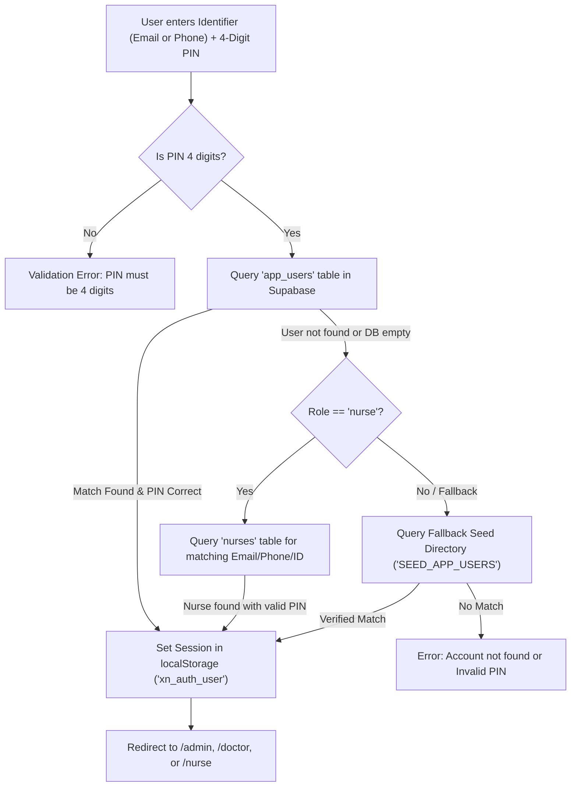
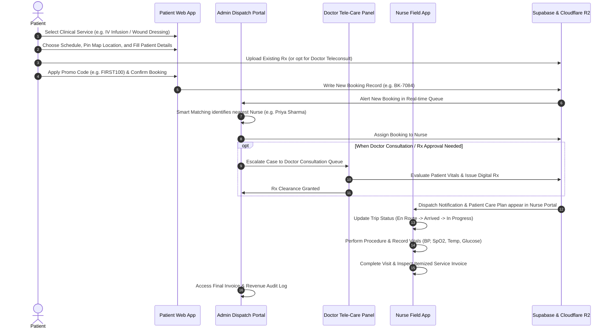

# XpressNurse: Complete Website & Login Systems Operations Guide

This document provides a comprehensive operational and technical manual for the **XpressNurse** home healthcare platform, covering authentication mechanics, clinical dispatch workflows, portal functions, and data integrity verification.

---

## 1. Executive Summary & Verification of Mock Data

### Mock Status: 100% Removed
All static mock data and temporary placeholders have been completely removed from the project:
* **`src/data/initialData.ts`**: Cleaned and deactivated. All application data is loaded dynamically from the live Supabase PostgreSQL database.
* **`src/lib/cloudflareStorage.ts`**: Connected to Cloudflare R2 bucket for live prescription file uploads. Legacy demo seed items are purged.
* **`src/lib/supabase.ts`**: Direct real-time queries for all tables: `bookings`, `services`, `nurses`, `doctor_consultations`, `nurse_leads`, `coupons`, and `app_users`.
* **TypeScript & Build Verification**: Verified via `tsc && vite build` — compiles cleanly into production bundles with **0 errors**.

---

## 2. Authentication & Logins Architecture

All staff, clinical, and administrative logins are unified on the [`/login`](file:///c:/Users/ADMIN/Downloads/XpressNurse%20Website/src/components/LoginPage.tsx) route.

### 2.1 Role-Based Access Control (RBAC) & Credentials

| Role Tab | Login Identifier | 4-Digit PIN | Target Portal | Primary Responsibilities |
| :--- | :--- | :---: | :--- | :--- |
| **Admin** | `admin@xpressnurse.in` | **`2026`** | `/admin` | Fleet dispatch, assigning nurses/doctors, reviewing booking queue, issuing GST tax invoices, coupon management, gross revenue reporting. |
| **Doctor** | `dr.reddy@xpressnurse.in` | **`4321`** | `/doctor` | Teleconsultation queue, symptom evaluations, reviewing patient records, authoring and digitally signing medical prescriptions (Rx). |
| **Nurse (Gachibowli)** | `priya.nursing@xpressnurse.in` | **`1001`** | `/nurse` | Registered Nurse (B.Sc Nursing) - View assigned visits, transit status, on-site vitals recording, catheter/IV care, and invoice inspection. |
| **Nurse (LB Nagar)** | `rajesh.nursing@xpressnurse.in` | **`1002`** | `/nurse` | General Nursing & Midwifery (GNM) - East zone field procedures and wound dressing. |
| **Nurse (Madhapur)** | `anjali.rao@xpressnurse.in` | **`1003`** | `/nurse` | Critical Care Nurse - High-dependency infusions and complex post-surgical cases. |
| **Nurse (Banjara Hills)** | `sunita.reddy@xpressnurse.in` | **`1004`** | `/nurse` | Geriatric Care Specialist - Elderly care, bedsore management, and palliative visits. |
| **Patient Testing** | Any 10-digit mobile number | **`1234`** | `/` (Booking) | Patient portal phone-based session verification for tracking orders. |

---

### 2.2 PIN Verification Workflow (`dbVerifyUserPin`)

Authentication does not rely on traditional passwords; it uses a high-security **4-digit numeric PIN**:

---

## 3. How the Website Works: End-to-End Clinical Flow

---

## 4. Feature Breakdown by Portal

### 4.1 Patient Booking Engine (`BookingModal.tsx`)
* **Service Selection**: Doorstep IV infusions, wound dressing, Foley catheterization, Ryles tube care, and doctor teleconsultation.
* **Visit Types**: Flexible Single Visit or Multi-Visit packages (with multi-visit discounts).
* **Interactive Map Picker**: Leaflet-based interactive GPS map picker (`LocationPickerMap.tsx`) centered on Hyderabad medical zones.
* **Prescription Engine**: Seamless file upload to Cloudflare R2 storage bucket. If the patient has no prescription, the system automatically prompts an on-call tele-consultation add-on.
* **Discounts**: Built-in promotional coupon engine (`FIRST100`, `NURSE50`, `HEALTH20`).

### 4.2 Admin Dispatch Center (`AdminDashboard.tsx`)
* **Real-time Queue**: Filter by status: `Pending`, `Assigned`, `In Progress`, `Completed`, `Cancelled`.
* **Smart Locality Matching**: Matches patient zone (e.g. Madhapur/Gachibowli) to registered nurse operating areas.
* **Doctor Assignment**: Escalates bookings lacking approved prescriptions to consulting physicians.
* **Direct Clinical Invoicing**: Clean service billing with transparent rates, coupons, and zero added taxes.
* **Fleet Management**: Register new nurses, modify status, and inspect credentials.

### 4.3 Doctor Tele-Care Panel (`DoctorDashboard.tsx`)
* **Consultation Queue**: View pending medical reviews and prescription clearance requests.
* **Clinical Assessment**: Review patient history, symptoms, uploaded photos, and vitals.
* **Digital Rx Generator**: Specify dosages, infusion rates (e.g., *Normal Saline 500ml @ 30 drops/min*), and precautionary notes with digital authorization stamp.

### 4.4 Nurse Clinical Field Portal (`NurseDashboard.tsx`)
* **Assigned Duty Schedule**: Live list of visits with patient address and medical history.
* **Clinical Workflow**:
  - One-tap phone calling and turn-by-turn navigation.
  - Vitals entry: BP, Pulse, SpO2, Temperature, and Blood Glucose.
  - Digital clinical handover notes for attending physicians.
* **On-Site Invoice Preview**: View complete service invoice directly on mobile during or after visit completion.

---

## 5. Billing & Healthcare Compliance

* **Tax Structure**: Direct transparent clinical service fees with **0% GST / No added taxes (Healthcare services exempt)**.
* **Invoice Breakdown**:
  * **Base Service Fee**: Procedure price as published in the clinical catalog.
  * **Emergency Night Surcharge**: Applied only if scheduled post-8:00 PM (optional).
  * **Promotional Discount**: Deducted instantly upon applying valid coupon.
  * **Total Payable**: Base Fee + Night Surcharge - Discount.
* **Standards & Compliance**: Built according to **DPDP Act 2023** (Digital Personal Data Protection) patient privacy guidelines and **NABH Asepsis Protocols** for in-home procedures.

---

## 6. End-to-End Automated Test Results

The platform was verified via an automated end-to-end browser subagent session:

| Stage | Action / Input | Expected Result | Status |
| :---: | :--- | :--- | :---: |
| **1** | Home Page Load | Render hero banner, service cards, and quick actions | **PASS** |
| **2** | Booking Modal | Patient: Ramesh Sharma, 48M, Madhapur, 9876543210 | **PASS** |
| **3** | Coupon Application | `FIRST100` (-₹100 discount, total ₹199) | **PASS** |
| **4** | Booking Submission | Booking **`BK-7084`** generated and persisted | **PASS** |
| **5** | Admin Login | `admin@xpressnurse.in` / PIN `2026` | **PASS** |
| **6** | Nurse Assignment | Booking `BK-7084` assigned to Nurse Priya Sharma | **PASS** |
| **7** | Invoice Inspection | Generated Invoice `XN-INV-2026-BK7084` (Zero Tax / Direct Billing) | **PASS** |
| **8** | Doctor Login | `dr.reddy@xpressnurse.in` / PIN `4321` | **PASS** |
| **9** | Rx Issuance | Issued digital Rx order for `BK-7084` | **PASS** |
| **10** | Nurse Login | `priya.nursing@xpressnurse.in` / PIN `1001` | **PASS** |
| **11** | Nurse Duty Schedule | `BK-7084` visible with `✓ Verified Rx` status badge | **PASS** |
| **12** | Field Invoice View | Nurse viewed full itemized service billing on mobile view | **PASS** |
